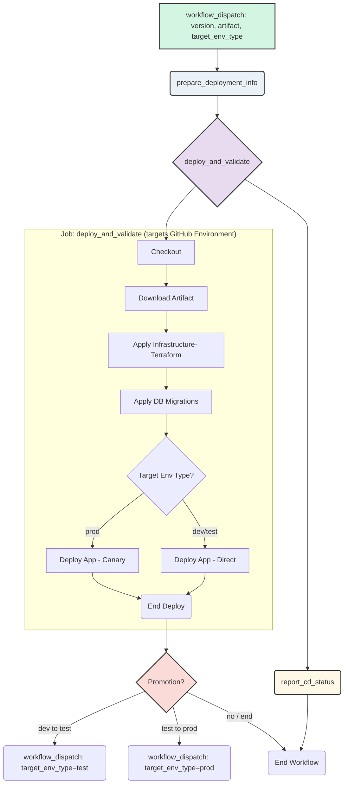

```mermaid
graph TD
    A[workflow_dispatch: version, artifact, target_env_type] --> B(prepare_deployment_info);
    B --> C{deploy_and_validate};
    C --> D[Checkout];
    D --> E[Download Artifact];
    E --> F[Apply Infrastructure- Terraform];
    F --> G[Apply DB Migrations];
    G --> H{Target Env Type?};
    H -- prod --> I[Deploy App - Canary];
    H -- dev/test --> J[Deploy App - Direct];
    I --> K(End Deploy);
    J --> K;
    C --> L(report_cd_status);
    K --> M{Promotion?};
    M -- dev to test --> A_test(workflow_dispatch: target_env_type=test);
    M -- test to prod --> A_prod(workflow_dispatch: target_env_type=prod);
    M -- no / end --> N(End Workflow);
    L --> N;

    subgraph "Job: deploy_and_validate (targets GitHub Environment)"
        direction LR
        D
        E
        F
        G
        H
        I
        J
        K
    end

    style A fill:#D5F5E3,stroke:#333,stroke-width:2px
    style B fill:#EAF2F8,stroke:#333,stroke-width:2px
    style C fill:#E8DAEF,stroke:#333,stroke-width:2px
    style L fill:#FEF9E7,stroke:#333,stroke-width:2px
    style M fill:#FADBD8,stroke:#333,stroke-width:2px
```