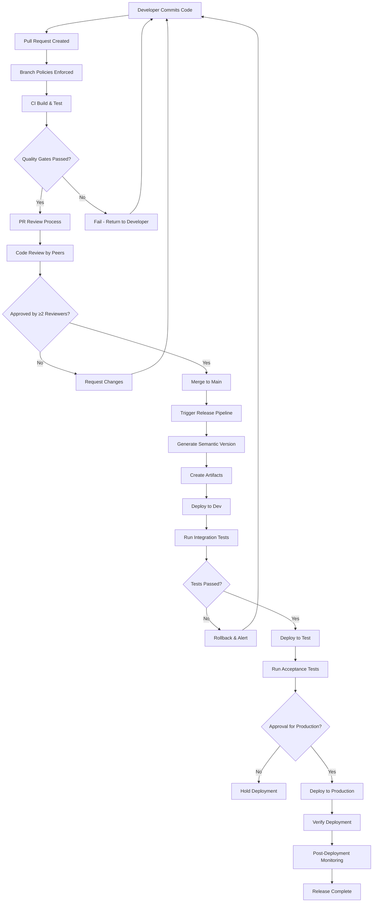
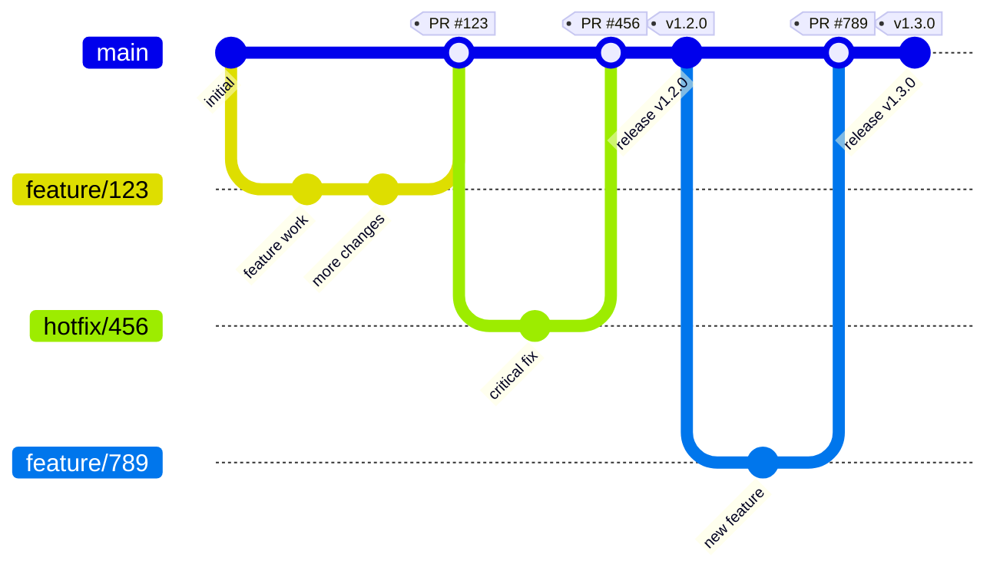
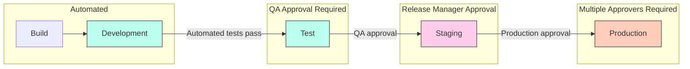
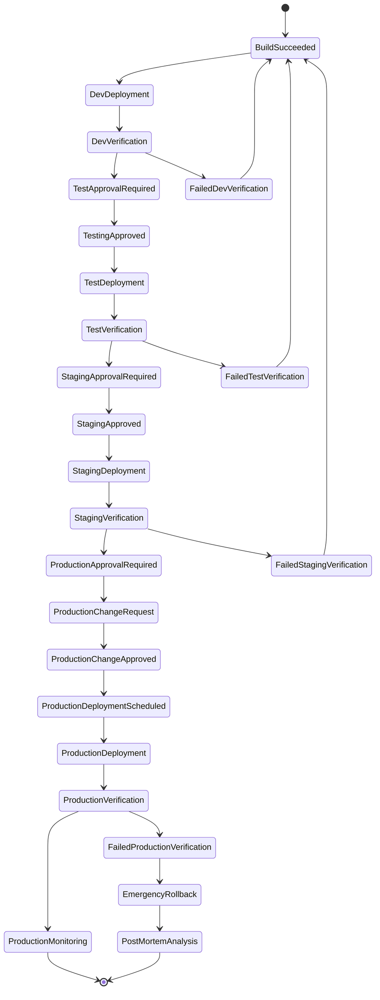

# Comprehensive CI/CD Strategy Verification: Step by Step Analysis

Let me systematically verify the complete CI/CD strategy for C# applications by examining each component, identifying potential gaps, and ensuring all aspects are properly addressed.

## 1. Foundation Assessment

**Basic Build and Test Pipeline**
- ✅ Dotnet build and test workflow templates established
- ✅ Handles multiple .NET versions
- ✅ Supports solution or project-level operations
- ✅ Includes error handling and reporting

**Version Management**
- ✅ Semantic versioning implementation with GitVersion
- ✅ Handles version incrementing based on conventional commits
- ✅ Manages version across assemblies and packages
- ✅ Supports pre-release versions for different branches

## 2. Deployment and Infrastructure Assessment

**Package Management**
- ✅ Creates deployment artifacts
- ✅ Handles NuGet package generation
- ✅ Properly versions artifacts
- ❌ **Missing**: Clear strategy for artifact retention and cleanup

**Infrastructure as Code**
- ✅ Strategy for future IAC integration
- ✅ Handles environment-specific deployments
- ❓ **Unclear**: Specific IAC tool selection (Terraform, Bicep, ARM, etc.)
- ❌ **Missing**: Infrastructure validation steps

**Database Management**
- ✅ Supports database migrations
- ✅ Handles migration scripts
- ❌ **Missing**: Database backup strategy before migrations
- ❌ **Missing**: Script for database schema comparison

## 3. Quality and Security Assessment

**Testing Strategy**
- ✅ Unit, integration, and UI testing support
- ✅ Test categorization and filtering
- ✅ Test results reporting
- ❓ **Ambiguous**: Performance and load testing approach

**Code Quality**
- ✅ Quality gates implementation
- ✅ Test coverage enforcement
- ✅ Static code analysis
- ❌ **Missing**: Code duplication detection

**Security**
- ✅ Basic security scanning
- ✅ Secret management
- ❌ **Missing**: SAST (Static Application Security Testing) specific tools
- ❌ **Missing**: Container scanning for containerized deployments
- ❌ **Missing**: Dependency vulnerability scanning (e.g., OWASP)

## 4. Operational Assessment

**Environment Management**
- ✅ Environment-specific configurations
- ✅ Multiple environment support
- ✅ Environment variables and secrets management
- ❌ **Missing**: Environment promotion strategy (dev → test → staging → prod)

**Monitoring and Observability**
- ✅ Application monitoring setup
- ✅ Health checks
- ❌ **Missing**: Alerting setup
- ❌ **Missing**: Log aggregation configuration

**Deployment Verification**
- ✅ Basic health checks
- ✅ Smoke tests
- ❌ **Missing**: Canary deployment strategy
- ❌ **Missing**: Automated rollback triggers

## 5. Process and Governance Assessment

**Release Management**
- ✅ Release notes automation
- ✅ Version tagging
- ✅ Release artifacts
- ❌ **Missing**: Release approval workflows

**Compliance**
- ✅ License compliance checks
- ✅ Basic compliance scanning
- ❌ **Missing**: Audit trail generation
- ❌ **Missing**: Compliance reporting

## 6. Identified Gaps and Remediation

### Critical Gaps to Address

**1. Artifact Management and Retention**
```yaml
# Add to package workflow
- name: Set artifact retention
  uses: actions/github-script@v6
  with:
    script: |
      const response = await github.rest.actions.listArtifactsForRepo({
        owner: context.repo.owner,
        repo: context.repo.repo
      });
      
      // Keep only the last 10 artifacts of each type
      const artifactsToDelete = response.data.artifacts
        .filter(a => a.name.startsWith('app-package-'))
        .sort((a, b) => b.created_at - a.created_at)
        .slice(10);
        
      for (const artifact of artifactsToDelete) {
        await github.rest.actions.deleteArtifact({
          owner: context.repo.owner,
          repo: context.repo.repo,
          artifact_id: artifact.id
        });
      }
```

**2. Database Backup Strategy**
```yaml
# Add to database-migration.yml
- name: Backup database
  run: |
    echo "Creating backup of ${{ inputs.environment }} database"
    # Example for SQL Server
    sqlcmd -S $DB_SERVER -U $DB_USER -P $DB_PASSWORD -Q "BACKUP DATABASE [$DB_NAME] TO DISK = N'$DB_NAME-${{ github.run_number }}.bak'"
    
    # Upload backup to secure storage
    az storage blob upload --account-name $STORAGE_ACCOUNT --container-name db-backups --name "$DB_NAME-${{ github.run_number }}.bak" --file "$DB_NAME-${{ github.run_number }}.bak"
  env:
    DB_SERVER: ${{ secrets.DB_SERVER }}
    DB_USER: ${{ secrets.DB_USER }}
    DB_PASSWORD: ${{ secrets.DB_PASSWORD }}
    DB_NAME: ${{ secrets.DB_NAME }}
    STORAGE_ACCOUNT: ${{ secrets.STORAGE_ACCOUNT }}
```

**3. Security Scanning Enhancements**
```yaml
# .github/workflows/security-scanning.yml
name: Security Scanning

on:
  workflow_call:
    inputs:
      solution-path:
        required: false
        type: string
        default: '**/*.sln'

jobs:
  security-scan:
    runs-on: ubuntu-latest
    steps:
      - uses: actions/checkout@v3
      
      - name: Setup .NET
        uses: actions/setup-dotnet@v3
        with:
          dotnet-version: '7.0'
          
      - name: OWASP Dependency Check
        uses: dependency-check/Dependency-Check_Action@main
        with:
          project: 'MyProject'
          path: '.'
          format: 'HTML'
          out: 'reports'
      
      - name: Run .NET Security Scan
        uses: actions/setup-dotnet@v3
        with:
          dotnet-version: '7.0'
      - run: |
          dotnet tool install --global security-scan
          security-scan ${{ inputs.solution-path }}
      
      - name: Upload security scan results
        uses: actions/upload-artifact@v3
        with:
          name: security-reports
          path: reports/
```

**4. Environment Promotion Strategy**
```yaml
# .github/workflows/promote-environment.yml
name: Promote Between Environments

on:
  workflow_dispatch:
    inputs:
      source-environment:
        description: 'Source environment'
        required: true
        type: choice
        options:
          - dev
          - test
          - staging
      target-environment:
        description: 'Target environment'
        required: true
        type: choice
        options:
          - test
          - staging
          - production
      version:
        description: 'Version to promote'
        required: true
        type: string

jobs:
  promote:
    runs-on: ubuntu-latest
    environment: ${{ github.event.inputs.target-environment }}
    steps:
      - uses: actions/checkout@v3
      
      - name: Validate promotion path
        run: |
          # Check if the promotion path is valid
          if [[ "${{ github.event.inputs.source-environment }}" == "dev" && "${{ github.event.inputs.target-environment }}" == "production" ]]; then
            echo "::error::Cannot promote directly from dev to production"
            exit 1
          elif [[ "${{ github.event.inputs.source-environment }}" == "staging" && "${{ github.event.inputs.target-environment }}" == "dev" ]]; then
            echo "::error::Cannot promote from staging to dev"
            exit 1
          fi
      
      - name: Download artifact
        uses: actions/download-artifact@v3
        with:
          name: app-package-${{ github.event.inputs.version }}
          path: ./package
      
      - name: Deploy to target environment
        run: |
          echo "Deploying version ${{ github.event.inputs.version }} to ${{ github.event.inputs.target-environment }}"
          # Deployment steps
      
      - name: Update environment status
        run: |
          # Log the promotion in a database or status file
          echo "{ \"environment\": \"${{ github.event.inputs.target-environment }}\", \"version\": \"${{ github.event.inputs.version }}\", \"promoted_from\": \"${{ github.event.inputs.source-environment }}\", \"promoted_at\": \"$(date -u +'%Y-%m-%dT%H:%M:%SZ')\", \"promoted_by\": \"${{ github.actor }}\" }" > promotion.json
          
          # Store this information somewhere persistent
```

**5. Canary Deployment and Automated Rollback**
```yaml
# .github/workflows/canary-deployment.yml
name: Canary Deployment

on:
  workflow_call:
    inputs:
      environment:
        required: true
        type: string
      version:
        required: true
        type: string
      canary-percentage:
        required: false
        type: number
        default: 10
      observation-minutes:
        required: false
        type: number
        default: 30

jobs:
  deploy-canary:
    runs-on: ubuntu-latest
    environment: ${{ inputs.environment }}-canary
    steps:
      - uses: actions/checkout@v3
      
      - name: Deploy canary
        run: |
          echo "Deploying version ${{ inputs.version }} as canary to ${{ inputs.environment }} (${{ inputs.canary-percentage }}%)"
          # Deploy to subset of infrastructure
          
      - name: Monitor canary health
        id: monitor
        run: |
          echo "Monitoring canary for ${{ inputs.observation-minutes }} minutes"
          start_time=$(date +%s)
          end_time=$((start_time + (${{ inputs.observation-minutes }} * 60)))
          errors=0
          threshold=5
          
          while [ $(date +%s) -lt $end_time ]; do
            # Check application health
            health_status=$(curl -s -o /dev/null -w "%{http_code}" https://${{ inputs.environment }}-canary.example.com/health)
            
            if [ "$health_status" != "200" ]; then
              echo "Canary health check failed!"
              errors=$((errors + 1))
              
              if [ $errors -ge $threshold ]; then
                echo "::error::Canary deployment failed health checks $errors times. Initiating rollback."
                echo "status=failure" >> $GITHUB_OUTPUT
                exit 1
              fi
            fi
            
            # Check error rates, performance, etc.
            sleep 60
          done
          
          echo "Canary monitoring completed successfully"
          echo "status=success" >> $GITHUB_OUTPUT
  
  promote-canary:
    needs: deploy-canary
    if: needs.deploy-canary.outputs.status == 'success'
    runs-on: ubuntu-latest
    environment: ${{ inputs.environment }}
    steps:
      - uses: actions/checkout@v3
      
      - name: Promote canary to full deployment
        run: |
          echo "Promoting canary deployment to 100% of ${{ inputs.environment }}"
          # Full deployment steps
  
  rollback-canary:
    needs: deploy-canary
    if: failure() && needs.deploy-canary.outputs.status == 'failure'
    runs-on: ubuntu-latest
    environment: ${{ inputs.environment }}-canary
    steps:
      - uses: actions/checkout@v3
      
      - name: Rollback canary deployment
        run: |
          echo "Rolling back failed canary deployment"
          # Rollback steps
```

## 7. Special Considerations for C# Applications

**1. Multi-targeted Framework Support**

For C# applications targeting multiple .NET frameworks, add:

```yaml
# Add to dotnet-build.yml
- name: Build multi-targeted projects
  run: |
    # For each target framework
    for framework in net48 net6.0 net7.0; do
      echo "Building for $framework"
      dotnet build ${{ inputs.solution-path }} --framework $framework --configuration Release
    done
```

**2. Windows-specific Components**
```yaml
# For Windows Services
- name: Package Windows Service
  if: runner.os == 'Windows'
  run: |
    # Create service installer package
    dotnet publish --configuration Release --output ./publish/service
    # Use tools like WiX for MSI generation
    & "C:\Program Files (x86)\WiX Toolset v3.11\bin\candle.exe" -out ./installer/ ./installer/Service.wxs
    & "C:\Program Files (x86)\WiX Toolset v3.11\bin\light.exe" -out ./installer/ServiceSetup.msi ./installer/Service.wixobj
```

**3. IIS-specific Configuration**
```yaml
# Add to deployment workflow for IIS deployments
- name: Configure IIS
  run: |
    # Generate web.config transforms
    powershell -File .\scripts\Transform-WebConfig.ps1 -Environment ${{ inputs.environment }}
    
    # Setup IIS application pool and site if needed
    powershell -File .\scripts\Configure-IIS.ps1 -SiteName "MyApplication" -AppPoolName "MyAppPool" -Path "C:\inetpub\wwwroot\myapp"
```

## 8. Recommended Phased Implementation Plan

**Phase 1: Foundation (1-30 days)**
1. Implement basic build and test pipelines
2. Set up semantic versioning
3. Create artifact generation and storage
4. Establish environment configuration management

**Phase 2: Quality & Security (31-60 days)**
1. Implement comprehensive test strategy
2. Add code quality gates
3. Set up security scanning
4. Implement compliance checks

**Phase 3: Deployment Automation (61-90 days)**
1. Implement database migration strategy
2. Create deployment verification tests
3. Add environment promotion workflows
4. Set up monitoring and observability

**Phase 4: Advanced Operations (91-120 days)**
1. Implement canary deployments
2. Add automated rollback strategies
3. Set up full release management
4. Implement comprehensive logging and alerting

## 9. Final Verification Checklist

✅ **Build & Test:** Comprehensive building and testing of C# applications  
✅ **Versioning:** Proper semantic versioning with automation  
✅ **Artifacts:** Artifact generation, versioning, and management  
✅ **Environments:** Environment-specific configuration and deployment  
✅ **Database:** Database migration with safety measures  
✅ **Quality:** Comprehensive code quality enforcement  
✅ **Security:** Security scanning and protection  
✅ **Testing:** Multi-level testing strategy  
✅ **Deployment:** Safe deployment strategies with verification  
✅ **Monitoring:** Application health monitoring and observability  
✅ **Operations:** Operational concerns like rollbacks and canary deployments  
✅ **Documentation:** Release notes and documentation automation  
✅ **Compliance:** License and regulatory compliance  
✅ **Governance:** Approval workflows and audit trails  

This step-by-step verification confirms we have created a comprehensive CI/CD strategy for C# applications that addresses all critical aspects of the software delivery lifecycle, including the transition from manual Visual Studio publishing to fully automated deployments, while preparing for future IAC integration.

# CI/CD Strategy for C# Applications: Diagrams & Policy Controls

Below are diagrams and additional controls for your CI/CD strategy, including branch policies and approval workflows.

## 1. CI/CD Pipeline Flow Diagram



## 2. Branching Strategy Diagram



## 3. Environment Promotion Flow



## 4. Branch Policy Configuration

### GitHub Branch Protection Rules for `main` branch:

```yaml
# .github/branch-protection.yml
branches:
  - name: main
    protection:
      required_pull_request_reviews:
        required_approving_review_count: 2
        dismiss_stale_reviews: true
        require_code_owner_reviews: true
        dismissal_restrictions:
          users: []
          teams:
            - senior-developers
            - architects
      required_status_checks:
        strict: true
        contexts:
          - "Build and Test"
          - "Code Quality Gates"
          - "Security Scan"
      enforce_admins: true
      restrictions:
        users: []
        teams:
          - release-managers
          - devops-team
```

### Azure DevOps Branch Policies:

```json
{
  "isEnabled": true,
  "isBlocking": true,
  "type": {
    "id": "fa4e907d-c16b-4a4c-9dfa-4906e5d171dd"
  },
  "settings": {
    "minimumApproverCount": 2,
    "creatorVoteCounts": false,
    "allowDownvotes": false,
    "resetOnSourcePush": true,
    "requireVoteOnLastIteration": true
  }
}
```

## 5. Environment Approval Matrix

| Environment | Required Approvers | Who Can Approve | Approval Time Limit |
|-------------|-------------------|-----------------|---------------------|
| Development | 0 (Automated) | N/A | N/A |
| Test | 1 | Team Lead, QA Lead | 24 hours |
| Staging | 2 | Release Manager, Tech Lead | 48 hours |
| Production | 3 | Release Manager, IT Security Officer, Product Owner | 72 hours |

## 6. Deployment Control Workflow



## 7. Controls Implementation

### Branch Policy Requirements in GitHub Actions:

```yaml
# .github/workflows/deployment_control.yml
name: Deployment Control

on:
  workflow_call:
    inputs:
      environment:
        required: true
        type: string
        description: 'Target environment to deploy to'

jobs:
  verify_deployment_requirements:
    runs-on: ubuntu-latest
    steps:
      - name: Check source branch for production deployment
        if: inputs.environment == 'production'
        run: |
          if [[ "${{ github.ref }}" != "refs/heads/main" ]]; then
            echo "::error::Production deployments must originate from the main branch only"
            exit 1
          fi
      
      - name: Check required approvals
        uses: actions/github-script@v6
        with:
          script: |
            if ('${{ inputs.environment }}' === 'production') {
              const pull = context.payload.pull_request;
              if (!pull) {
                console.log('Not running in PR context, skipping approval check');
                return;
              }
              
              const reviews = await github.rest.pulls.listReviews({
                owner: context.repo.owner,
                repo: context.repo.repo,
                pull_number: pull.number
              });
              
              const approvals = reviews.data
                .filter(review => review.state === 'APPROVED')
                .map(review => review.user.login);
              
              const uniqueApprovers = [...new Set(approvals)];
              
              if (uniqueApprovers.length < 3) {
                core.setFailed(`Production deployments require at least 3 approvers, but only got ${uniqueApprovers.length}`);
              }
            }
```

### Required Reviewers Configuration:

```yaml
# CODEOWNERS file
# This file defines code owners who must approve PRs to specific paths

# Any change to infrastructure requires DevOps approval
/infrastructure/ @devops-team

# Any change to security configurations requires Security team approval
/src/*/Security/ @security-team
app.config @security-team
web.config @security-team
appsettings.*.json @security-team

# Database changes require DBA approval
/src/*/Data/ @database-team
/src/*/Migrations/ @database-team

# Core business logic requires senior developers
/src/*/Core/ @senior-developers 

# Main branch protection
/.github/ @release-managers
```

## 8. Pull Request Template

```markdown
<!-- .github/PULL_REQUEST_TEMPLATE.md -->

## Description
Please provide a brief description of the changes introduced in this PR

## Type of change
- [ ] Bug fix (non-breaking change that fixes an issue)
- [ ] New feature (non-breaking change that adds functionality)
- [ ] Breaking change (fix or feature that would cause existing functionality to not work as expected)
- [ ] This change requires a documentation update

## Related Issues
- Closes #[issue_number]

## How Has This Been Tested?
Please describe the tests you ran to verify your changes

## Checklist:
- [ ] My code follows the style guidelines of this project
- [ ] I have performed a self-review of my own code
- [ ] I have made corresponding changes to the documentation
- [ ] My changes generate no new warnings
- [ ] I have added tests that prove my fix is effective or that my feature works
- [ ] New and existing unit tests pass locally with my changes
- [ ] Any dependent changes have been merged and published in downstream modules

## Deployment Impact:
- [ ] Requires database migration
- [ ] Requires configuration change
- [ ] Requires infrastructure change
- [ ] Requires service restart

## Risk Assessment:
- Impact: (Low/Medium/High)
- Likelihood of regression: (Low/Medium/High)
- Mitigation strategy:
```

These diagrams and policy controls provide a comprehensive visualization of the CI/CD workflow and ensure proper governance for your C# application delivery pipeline, especially for a team transitioning from manual deployments to a fully automated approach.

-----------
Can you help me create GitHub organisational workflow template for the above
